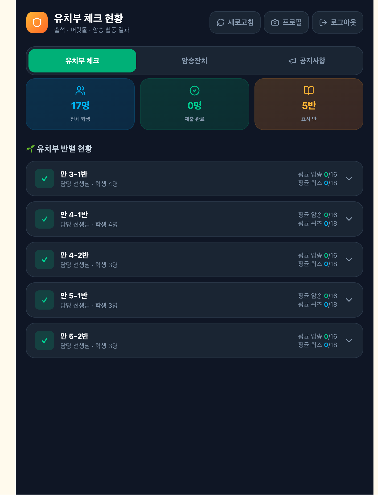
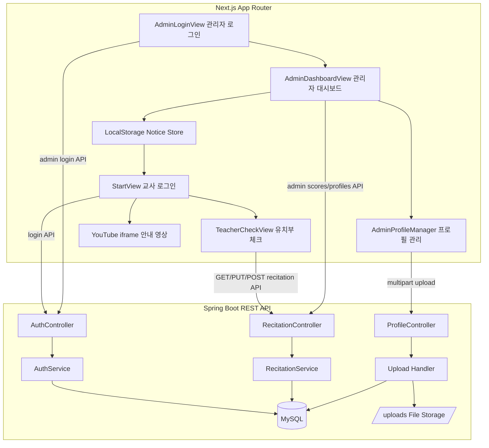

# ⛪ 동탄교회 유치부 체크 시스템

<div align="center">
  <h2>Kindergarten Check System (교사용 유치부 출석·공과·암송 관리 시스템)</h2>
  <p><strong>동탄교회 유치부 체크 시스템</strong>은 교사가 모바일 환경에서 학생별 출석, 머릿돌, 암송 활동을 빠르게 기록하고 관리자가 전체 반의 진행 현황과 프로필, 공지사항을 관리할 수 있는 풀스택 웹 애플리케이션입니다.</p>
</div>

---

## 📸 프로젝트 미리보기 (Preview)

<!-- 스크린샷 파일명을 영문으로 정리한 뒤 아래 경로를 사용하면 GitHub에서 안정적으로 표시됩니다. -->
<!--
<p align="center">
  
  
</p>
-->

### 🎬 데모 영상

- [이번 주 공과 영상](https://www.youtube.com/watch?v=DNobgocypGg)

---

## 👥 사용자 역할 및 주요 화면 (User Registry)

본 프로젝트는 **교사와 관리자 역할을 분리**하여, 실제 유치부 운영 흐름에 맞는 모바일 중심 화면과 관리자용 현황 관리 화면을 제공합니다.

| 사용자 | 담당 화면 | 주요 기능 | 특징 |
|--------|-----------|-----------|------|
| **교사** | **StartView / TeacherCheckView** | 로그인, 담당 반 진입, 학생별 출석·머릿돌·암송 체크 | 모바일 터치 환경 최적화 |
| **보조교사** | **StartView / TeacherCheckView** | 교사 기능 + 보조교사용 안내 영상 조건부 표시 | `role === "부교사"` 기반 UI 분기 |
| **관리자** | **AdminDashboardView / AdminProfileManager** | 전체 반 현황 조회, 제출 잠금 해제, 프로필 관리, 공지사항 관리 | 반별/학생별 데이터 통합 관리 |

---

## 🌟 주요 기능 (기여도: 상: ⭐ / 중: ★ / 하: ☆)

*교사용 모바일 UI, 관리자 대시보드, Spring Boot REST API, JPA 기반 데이터 처리, MySQL 연동을 직접 구현했습니다.*

### ✅ 개발 완료

| 기능명 | 설명 | 기여도 |
|--------|------|--------|
| **교사 로그인 및 담당 반 자동 진입** | 교사 계정 인증 후 담당 반 ID를 기반으로 유치부 체크 화면 연결 | 상 ⭐ |
| **유치부 활동 체크** | 학생별 출석, 머릿돌, 암송 상태를 과별로 체크하고 서버에 저장 | 상 ⭐ |
| **관리자 통합 대시보드** | 전체 반의 학생별 활동 현황과 진행률을 반별 아코디언 UI로 조회 | 상 ⭐ |
| **학생 기록 제출 및 잠금 해제** | 최종 제출된 학생 기록을 관리자 권한으로 수정 가능 상태로 변경 | 중 ★ |
| **프로필 이미지 관리** | 교사/학생 프로필 이미지 업로드, 저장, 미리보기 기능 구현 | 중 ★ |
| **공지사항 팝업 시스템** | 관리자가 등록한 공지를 선생님 시작 화면 팝업으로 표시 | 중 ★ |
| **역할 기반 영상 표시** | 모든 교사용 공통 영상과 보조교사용 조건부 영상 슬롯 구현 | 중 ★ |
| **암송잔치 기록 구조 유지** | 암송/퀴즈 성공 여부 기록 및 관리자 제출 현황 조회 기능 유지 | 중 ★ |
| **모바일 UI 최적화** | 큰 터치 영역, 안전 영역, 모바일 브라우저 높이 대응을 고려한 화면 설계 | 상 ⭐ |

### ⏳ 개발 예정

| 기능명 | 설명 |
|--------|------|
| **공지사항 DB 저장** | 현재 localStorage 기반 공지를 백엔드 DB/API 기반으로 전환 |
| **JWT 인증 시스템** | localStorage 기반 간이 로그인 상태를 토큰 기반 인증 구조로 개선 |
| **관리자 영상 링크 관리** | 관리자 페이지에서 공과/보조교사용 영상 URL을 직접 변경 |
| **배포 자동화** | Oracle Cloud VM 또는 PaaS 기반 백엔드/DB 배포 및 CI/CD 구성 |
| **운영 통계 화면** | 반별/월별 출석률, 암송률, 활동 완료율 차트 제공 |

---

## 🛠 사용 기술 스택

### - 🎨 Frontend

      

### - 🔧 Backend

    

### - 🗄 Database

 

### - ☁️ 실행 환경 (Infra) & 배포 (Deployment)

   

---

## 🏗️ 시스템 아키텍처 (System Architecture)



---

## 주요 화면 설명

### 1. 시작 페이지 (StartView)

<!--
<p align="center">
  
</p>
-->

* **모바일 교사용 진입 화면**<br>
  - 오늘 날짜와 서비스명을 상단에 표시하고, 아이디/비밀번호 입력 후 교사 로그인을 수행합니다.<br>
  - 로그인 성공 시 교사 이름, 역할, 담당 반, 프로필 이미지를 상태와 `localStorage`에 저장하여 새로고침 후에도 로그인 상태를 유지합니다.<br>
  - 운영용 UI에 맞춰 로그인 전 화면에서는 핵심 행동인 로그인 폼을 우선 배치하고, 안내 영상은 로그인 후 화면으로 이동시켰습니다.<br><br>

* **역할 기반 콘텐츠 표시**<br>
  - 모든 교사에게 공통 공과 영상을 표시합니다.<br>
  - 보조교사(`부교사`)에게만 보조교사용 영상 슬롯을 조건부 렌더링할 수 있도록 구현했습니다.<br><br>

### 2. 유치부 체크 페이지 (TeacherCheckView)

* **학생별 활동 체크**<br>
  - 로그인한 교사의 `classId`를 이용해 담당 반 학생 목록을 불러옵니다.<br>
  - 학생별로 출석, 머릿돌, 암송 활동을 과별로 체크할 수 있습니다.<br>
  - 체크 버튼은 모바일 터치 환경을 고려해 크게 구성했고, 상태 변경 시 API를 통해 즉시 저장합니다.<br><br>

* **제출 흐름 관리**<br>
  - 학생별 체크 결과를 최종 제출하여 관리자 화면에 반영할 수 있습니다.<br>
  - 제출 이후에는 관리자 권한으로 잠금을 해제해야 수정할 수 있도록 서버 로직을 분리했습니다.<br><br>

### 3. 관리자 대시보드 (AdminDashboardView)

<!--
<p align="center">
  
</p>
-->

* **전체 반 현황 관리**<br>
  - 관리자는 모든 반의 학생 체크 현황을 한 화면에서 확인할 수 있습니다.<br>
  - 반별 아코디언과 학생별 상세 영역을 통해 출석, 머릿돌, 암송 진행률을 빠르게 파악합니다.<br><br>

* **공지사항 관리**<br>
  - 공지 글을 추가/삭제할 수 있으며, 공지 버튼이 활성화된 글만 선생님 화면 팝업으로 표시됩니다.<br>
  - 현재는 프론트 `localStorage` 기반으로 동작하며, 추후 DB/API 기반으로 확장하기 쉬운 구조로 `notices.ts`에 공통 로직을 분리했습니다.<br><br>

### 4. 프로필 관리 페이지 (AdminProfileManager)

* **교사/학생 이미지 관리**<br>
  - 관리자는 교사와 학생 목록을 구분해 조회하고 프로필 이미지를 업로드할 수 있습니다.<br>
  - 백엔드의 multipart upload API를 통해 파일을 저장하고, DB에는 이미지 URL을 갱신합니다.<br><br>

### 5. 백엔드 API 및 데이터 관리

* **JPA 기반 기록 관리**<br>
  - `ClassEntity`, `Teacher`, `Student`, `RecitationRecord`, `Admin` 엔티티를 중심으로 반-교사-학생-활동기록 관계를 구성했습니다.<br>
  - `RecitationRecord`에는 날짜, 과 번호, 타입, 성공 여부, 제출 여부를 저장하여 일자별 기록 조회와 제출 잠금 처리를 지원합니다.<br><br>

---

## 🧬 테이블 명세서 및 ERD

### Entity-Relationship Diagram

```mermaid
erDiagram
    CLASS ||--o{ TEACHER : has
    CLASS ||--o{ STUDENT : has
    STUDENT ||--o{ RECITATION_RECORD : records
    TEACHER ||--o{ RECITATION_RECORD : writes

    ADMIN {
        bigint admin_id PK
        string login_id
        string password
        string name
        datetime created_at
    }

    CLASS {
        bigint class_id PK
        string class_name
        datetime created_at
    }

    TEACHER {
        bigint teacher_id PK
        string login_id
        string password
        string name
        string role
        text photo_url
        bigint class_id FK
        datetime created_at
    }

    STUDENT {
        bigint student_id PK
        string name
        string photo_url
        bigint class_id FK
        datetime created_at
    }

    RECITATION_RECORD {
        bigint record_id PK
        bigint student_id FK
        date record_date
        int lesson_number
        string type
        string result
        boolean submitted
        bigint teacher_id FK
        datetime updated_at
    }
```

<details>
  <summary>테이블 세부 명세서</summary>

  ### admin
  | 컬럼 | 설명 |
  |------|------|
  | admin_id | 관리자 PK |
  | login_id | 관리자 로그인 ID |
  | password | BCrypt 암호화 비밀번호 |
  | name | 관리자 이름 |
  | created_at | 생성일 |

  ### class
  | 컬럼 | 설명 |
  |------|------|
  | class_id | 반 PK |
  | class_name | 반 이름 |
  | created_at | 생성일 |

  ### teacher
  | 컬럼 | 설명 |
  |------|------|
  | teacher_id | 교사 PK |
  | login_id | 교사 로그인 ID |
  | password | BCrypt 암호화 비밀번호 |
  | name | 교사 이름 |
  | role | 정교사 / 부교사 |
  | photo_url | 교사 프로필 이미지 URL |
  | class_id | 담당 반 FK |
  | created_at | 생성일 |

  ### student
  | 컬럼 | 설명 |
  |------|------|
  | student_id | 학생 PK |
  | name | 학생 이름 |
  | photo_url | 학생 프로필 이미지 URL |
  | class_id | 소속 반 FK |
  | created_at | 생성일 |

  ### recitation_record
  | 컬럼 | 설명 |
  |------|------|
  | record_id | 기록 PK |
  | student_id | 학생 FK |
  | record_date | 기록 날짜 |
  | lesson_number | 과 번호 |
  | type | RECITATION, QUIZ, KINDERGARTEN_ATTENDANCE 등 |
  | result | SUCCESS / FAIL |
  | submitted | 최종 제출 여부 |
  | teacher_id | 기록 교사 FK |
  | updated_at | 수정일 |
</details>

---

## 🔌 API 요약

| Method | Endpoint | 설명 |
|--------|----------|------|
| POST | `/api/auth/login` | 교사 로그인 |
| POST | `/api/auth/admin/login` | 관리자 로그인 |
| GET | `/api/classes` | 반 목록 조회 |
| GET | `/api/classes/{classId}/recitations` | 특정 반 학생 체크 현황 조회 |
| PUT | `/api/students/{studentId}/recitation` | 학생 활동 체크 상태 저장 |
| POST | `/api/students/{studentId}/submit` | 학생 기록 최종 제출 |
| POST | `/api/admin/students/{studentId}/unlock` | 제출 잠금 해제 |
| GET | `/api/admin/scores` | 관리자 전체 현황 조회 |
| GET | `/api/admin/profiles` | 교사/학생 프로필 목록 조회 |
| POST | `/api/profiles/upload` | 프로필 이미지 업로드 |

---

## 🚀 실행 방법

### Backend

```bash
cd backend
mvn spring-boot:run
```

### Frontend

```bash
cd frontend
npm install
npm run dev
```

### Local URL

```text
Frontend: http://localhost:3000
Backend:  http://localhost:8080
```

### Environment

Frontend:

```env
NEXT_PUBLIC_API_BASE=http://localhost:8080
```

Backend:

```env
SPRING_DATASOURCE_URL=jdbc:mysql://localhost:3306/kindergaten?useUnicode=true&characterEncoding=utf8&serverTimezone=Asia/Seoul
SPRING_DATASOURCE_USERNAME=root
SPRING_DATASOURCE_PASSWORD=1234
APP_ALLOWED_ORIGINS=http://localhost:3000,http://localhost:3001
APP_PUBLIC_URL=http://localhost:8080
FILE_UPLOAD_DIR=uploads
```

---

## 💡 프로젝트 핵심 인사이트 & 배운 점 (Junior Developer View)

* **모바일 운영 환경을 고려한 UI 우선순위 설계**:
  처음에는 로그인 전 화면에 안내 영상을 배치했지만, 실제 운영에서는 교사가 가장 자주 수행하는 행동이 로그인과 체크 화면 진입이라는 점을 고려해 영상을 로그인 이후 화면으로 이동했습니다. 이를 통해 기능을 많이 보여주는 것보다 사용자 흐름에 맞는 정보 우선순위가 더 중요하다는 점을 배웠습니다.

* **역할 기반 조건부 렌더링 구조 설계**:
  교사와 보조교사의 역할이 다르다는 요구사항을 반영하기 위해 `role` 값을 기준으로 보조교사용 영상 슬롯을 조건부 표시했습니다. 단순한 UI 분기지만, 실제 운영자의 역할에 따라 다른 콘텐츠를 제공하는 구조를 설계해볼 수 있었습니다.

* **Next.js와 Spring Boot 분리형 풀스택 연동 경험**:
  프론트엔드와 백엔드를 독립적으로 실행하면서 CORS, API Base URL, 업로드 파일 공개 URL 등 분리 배포 환경에서 필요한 설정을 직접 다뤘습니다. 특히 개발 서버 포트가 바뀌었을 때 CORS 허용 Origin을 추가해야 한다는 점을 경험했습니다.

* **JPA 엔티티 관계 모델링 경험**:
  반, 교사, 학생, 활동 기록 사이의 관계를 JPA 엔티티로 매핑하고, 학생별/날짜별/과별 기록을 유니크하게 저장하도록 설계했습니다. 이를 통해 단순 체크 UI 뒤에도 데이터 정합성을 유지하는 테이블 설계가 중요하다는 점을 배웠습니다.

* **관리자와 교사 화면 간 데이터 흐름 분리**:
  관리자 공지사항과 선생님 팝업 기능을 구현하면서 공통 데이터 접근 로직을 `frontend/lib/notices.ts`로 분리했습니다. 작은 기능이라도 읽기/쓰기 책임을 분리하면 유지보수와 확장이 쉬워진다는 점을 체감했습니다.

* **파일 업로드와 정적 리소스 제공 처리**:
  프로필 이미지를 multipart로 업로드하고, 백엔드 서버의 `/uploads` 경로를 통해 정적 파일로 제공하는 흐름을 구현했습니다. DB에는 파일 자체가 아닌 URL을 저장하는 방식을 사용해 프론트 렌더링과 서버 저장 책임을 분리했습니다.

---

## 📌 담당 개발 내용

- 교사 로그인 화면 및 로그인 상태 유지 구현
- 담당 반 기반 유치부 체크 화면 이동 구현
- 학생별 출석, 머릿돌, 암송 체크 UI 및 API 연동
- 관리자 대시보드 반별/학생별 현황 UI 구현
- 관리자 공지사항 등록/삭제 및 선생님 팝업 연동
- 프로필 이미지 업로드 UI 및 백엔드 multipart API 연동
- Spring Boot REST API 및 JPA 기반 서비스 로직 구현
- MySQL 엔티티 관계 설계 및 기록 저장 구조 구성
- 모바일 중심 UI/UX 개선 및 운영 흐름 정리

---

## 🔮 향후 개선 사항

- 공지사항 DB 저장 및 관리자 API 전환
- JWT 기반 인증 및 권한 관리 도입
- 관리자 페이지에서 공과 영상/보조교사용 영상 링크 관리
- 반별/월별 출석률 및 활동 완료율 통계 차트 추가
- Oracle Cloud VM 또는 PaaS 기반 백엔드/DB 배포
- 프론트엔드/백엔드 테스트 코드 및 CI/CD 구성
