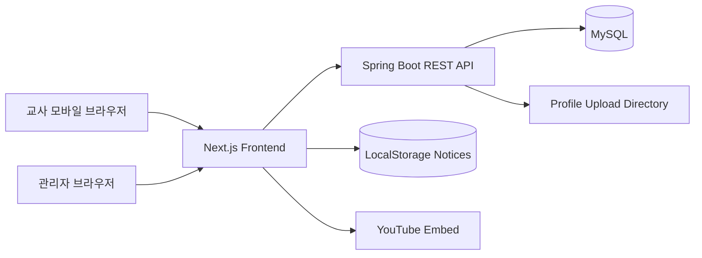

# 동탄교회 유치부 체크 시스템
## Kindergarten Attendance & Recitation Management System

**동탄교회 유치부 체크 시스템**은 유치부 교사가 모바일 환경에서 학생별 출석, 머릿돌, 암송 활동을 빠르게 체크하고, 관리자가 전체 반의 진행 현황과 프로필을 관리할 수 있는 교회학교 운영 보조 웹 애플리케이션입니다.

교사는 로그인 후 담당 반으로 바로 진입하여 학생별 활동 상태를 기록하고, 관리자는 반별 현황, 학생별 상세 기록, 프로필 이미지, 공지사항을 관리할 수 있습니다.

---

<!-- 프로젝트 스크린샷을 추가할 경우 아래 경로에 이미지를 배치해 사용하세요. -->
<!--  -->

---

<h2>프로젝트 기능 개요(기여도: 상: ⭐ / 중: ★ / 하: ☆)</h2>

| 기능명 | 설명 | 기여도 |
|--------|------|--------|
| **교사 로그인 및 담당 반 진입** | 교사 계정 인증 후 담당 반 체크 화면으로 이동 | 상 ⭐ |
| **유치부 활동 체크** | 학생별 출석, 머릿돌, 암송 활동을 과별로 체크 및 저장 | 상 ⭐ |
| **학생별 체크 현황 조회** | 반별 학생 목록과 활동 완료 상태를 모바일 UI로 제공 | 상 ⭐ |
| **관리자 대시보드** | 전체 반 학생들의 유치부 체크 및 암송잔치 현황 조회 | 상 ⭐ |
| **학생 제출 및 잠금 해제** | 최종 제출된 학생 기록을 관리자가 수정 가능 상태로 해제 | 중 ★ |
| **프로필 이미지 관리** | 관리자 페이지에서 교사/학생 프로필 이미지 업로드 및 변경 | 중 ★ |
| **공지사항 관리** | 관리자가 공지 글을 등록하고 선생님 화면에 팝업으로 전달 | 중 ★ |
| **역할 기반 안내 영상** | 교사 역할에 따라 공통 영상 및 보조교사용 영상을 조건부 표시 | 중 ★ |
| **암송잔치 기록 기능** | 암송/퀴즈 성공 여부를 기록하고 관리자 화면에서 제출 현황 확인 | 중 ★ |

---

<h2>기술 스택</h2>

### Frontend

- **Next.js 14**
- **React 18**
- **TypeScript**
- **Tailwind CSS**
- **lucide-react**
- **Radix UI Select**

<p align="left">
  
  
  
  
  
</p>

### Backend

- **Spring Boot 3.3**
- **Java 17**
- **Spring Data JPA**
- **Spring Security Crypto**
- **MySQL**
- **REST API**

<p align="left">
  
  
  
  
  
</p>

### Tools & Environment

- **Maven**
- **DBeaver**
- **Oracle Cloud / VM 배포 가능 구조**
- **Git**
- **YouTube iframe embed**
- **LocalStorage**

---

<h2>핵심 세부 기능 설명</h2>

### 교사 로그인 및 시작 화면

- 교사는 아이디와 비밀번호로 로그인합니다.
- 로그인 성공 시 교사 이름, 역할, 담당 반, 프로필 이미지를 저장합니다.
- `localStorage`에 교사 정보를 저장해 새로고침 후에도 로그인 상태를 유지합니다.
- 로그인 후 담당 반의 유치부 체크 화면으로 바로 이동할 수 있습니다.

### 유치부 체크 기능

- 학생별로 다음 활동을 체크할 수 있습니다.
  - 출석
  - 머릿돌
  - 암송
- 1년 과정 기준 과별 체크 UI를 제공합니다.
- 활동 상태는 서버 API를 통해 저장됩니다.
- 체크 결과는 관리자 대시보드에서 전체 반 기준으로 조회할 수 있습니다.

### 관리자 대시보드

- 전체 반의 학생 현황을 반별 아코디언 형태로 확인합니다.
- 학생별 활동 진행률과 상세 체크 상태를 조회합니다.
- 유치부 체크 현황과 암송잔치 현황을 탭으로 구분합니다.
- 최종 제출된 학생 기록은 관리자가 수정 허용 상태로 되돌릴 수 있습니다.

### 프로필 이미지 관리

- 관리자는 교사와 학생 프로필 이미지를 업로드할 수 있습니다.
- 업로드된 이미지는 백엔드 서버의 `/uploads` 경로로 제공됩니다.
- DB에는 이미지 URL이 저장되어 프론트에서 렌더링됩니다.

### 공지사항 팝업

- 관리자는 공지사항 탭에서 글을 추가하거나 삭제할 수 있습니다.
- 공지 버튼이 활성화된 상태로 등록한 글은 선생님 시작 화면에 팝업으로 표시됩니다.
- 공지 데이터는 현재 프론트의 `localStorage` 기반으로 관리되며, 추후 DB/API 기반으로 확장할 수 있습니다.

### 역할 기반 안내 영상

- 모든 교사에게 공통 안내 영상을 제공합니다.
- 보조교사(`부교사`)에게만 별도 영상을 보여줄 수 있도록 조건부 렌더링 구조를 구현했습니다.

---

## 전체 보기(자세히)

<details>
  <summary>교사 시작 화면</summary>

  ### 로그인 화면
  - 오늘 날짜와 서비스명을 표시합니다.
  - 아이디/비밀번호 입력 후 로그인합니다.
  - 모바일 터치 환경에 맞춰 입력창과 버튼 높이를 크게 구성했습니다.

  <!--  -->

  ### 로그인 후 선택 화면
  - 교사 프로필, 이름, 역할, 담당 반을 표시합니다.
  - 유치부 체크 화면으로 이동할 수 있습니다.
  - 안내 영상을 확인할 수 있습니다.

  <!--  -->
</details>

<details>
  <summary>유치부 체크 화면</summary>

  ### 학생 목록
  - 담당 반 학생 목록을 표시합니다.
  - 학생 프로필 이미지와 체크 진행률을 확인할 수 있습니다.

  ### 활동 체크
  - 과별로 출석, 머릿돌, 암송 활동을 체크합니다.
  - 체크 상태는 서버에 즉시 저장됩니다.

  <!--  -->
  <!--  -->
</details>

<details>
  <summary>관리자 대시보드</summary>

  ### 반별 현황
  - 전체 반의 학생 활동 현황을 조회합니다.
  - 반별/학생별 아코디언 UI로 상세 상태를 확인합니다.

  ### 공지사항 관리
  - 공지 글을 추가/삭제합니다.
  - 선생님 팝업 표시 여부를 공지 버튼 상태로 관리합니다.

  <!--  -->
  <!--  -->
</details>

<details>
  <summary>프로필 관리</summary>

  ### 교사/학생 프로필
  - 관리자 페이지에서 교사와 학생을 구분해 조회합니다.
  - 프로필 이미지를 업로드하고 저장합니다.

  <!--  -->
</details>

---

<h2>테이블 명세서 및 ERD</h2>

### Entity-Relationship Diagram

```mermaid
erDiagram
  CLASS ||--o{ TEACHER : has
  CLASS ||--o{ STUDENT : has
  STUDENT ||--o{ RECITATION_RECORD : records
  TEACHER ||--o{ RECITATION_RECORD : writes
  ADMIN {
    bigint admin_id PK
    string login_id
    string password
    string name
    datetime created_at
  }
  CLASS {
    bigint class_id PK
    string class_name
    datetime created_at
  }
  TEACHER {
    bigint teacher_id PK
    string login_id
    string password
    string name
    string role
    text photo_url
    bigint class_id FK
    datetime created_at
  }
  STUDENT {
    bigint student_id PK
    string name
    string photo_url
    bigint class_id FK
    datetime created_at
  }
  RECITATION_RECORD {
    bigint record_id PK
    bigint student_id FK
    date record_date
    int lesson_number
    string type
    string result
    boolean submitted
    bigint teacher_id FK
    datetime updated_at
  }
```

<details>
  <summary>테이블 세부 명세서</summary>

  ### admin
  | 컬럼 | 설명 |
  |------|------|
  | admin_id | 관리자 ID |
  | login_id | 관리자 로그인 ID |
  | password | BCrypt 암호화 비밀번호 |
  | name | 관리자 이름 |
  | created_at | 생성일 |

  ### class
  | 컬럼 | 설명 |
  |------|------|
  | class_id | 반 ID |
  | class_name | 반 이름 |
  | created_at | 생성일 |

  ### teacher
  | 컬럼 | 설명 |
  |------|------|
  | teacher_id | 교사 ID |
  | login_id | 교사 로그인 ID |
  | password | BCrypt 암호화 비밀번호 |
  | name | 교사 이름 |
  | role | 정교사/부교사 |
  | photo_url | 프로필 이미지 URL |
  | class_id | 담당 반 ID |
  | created_at | 생성일 |

  ### student
  | 컬럼 | 설명 |
  |------|------|
  | student_id | 학생 ID |
  | name | 학생 이름 |
  | photo_url | 프로필 이미지 URL |
  | class_id | 소속 반 ID |
  | created_at | 생성일 |

  ### recitation_record
  | 컬럼 | 설명 |
  |------|------|
  | record_id | 기록 ID |
  | student_id | 학생 ID |
  | record_date | 기록 날짜 |
  | lesson_number | 과 번호 |
  | type | RECITATION, QUIZ, KINDERGARTEN_* |
  | result | SUCCESS 또는 FAIL |
  | submitted | 최종 제출 여부 |
  | teacher_id | 기록 교사 ID |
  | updated_at | 수정일 |
</details>

---

## 시스템 구조도



---

## API 요약

| Method | Endpoint | 설명 |
|--------|----------|------|
| POST | `/api/auth/login` | 교사 로그인 |
| POST | `/api/auth/admin/login` | 관리자 로그인 |
| GET | `/api/classes` | 반 목록 조회 |
| GET | `/api/classes/{classId}/recitations` | 특정 반 학생 체크 현황 조회 |
| PUT | `/api/students/{studentId}/recitation` | 학생 활동 체크 상태 저장 |
| POST | `/api/students/{studentId}/submit` | 학생 기록 최종 제출 |
| POST | `/api/admin/students/{studentId}/unlock` | 제출 잠금 해제 |
| GET | `/api/admin/scores` | 관리자 전체 현황 조회 |
| GET | `/api/admin/profiles` | 교사/학생 프로필 목록 조회 |
| POST | `/api/profiles/upload` | 프로필 이미지 업로드 |

---

## 프로젝트 실행 방법

### Backend

```bash
cd backend
mvn spring-boot:run
```

기본 백엔드 주소:

```text
http://localhost:8080
```

### Frontend

```bash
cd frontend
npm install
npm run dev
```

기본 프론트 주소:

```text
http://localhost:3000
```

### 환경 변수

Frontend:

```env
NEXT_PUBLIC_API_BASE=http://localhost:8080
```

Backend:

```env
SPRING_DATASOURCE_URL=jdbc:mysql://localhost:3306/kindergaten?useUnicode=true&characterEncoding=utf8&serverTimezone=Asia/Seoul
SPRING_DATASOURCE_USERNAME=root
SPRING_DATASOURCE_PASSWORD=1234
APP_ALLOWED_ORIGINS=http://localhost:3000,http://localhost:3001
APP_PUBLIC_URL=http://localhost:8080
FILE_UPLOAD_DIR=uploads
```

---

## 담당 개발 내용

- 교사 로그인 및 로그인 상태 유지 구현
- 교사 담당 반 기반 체크 화면 이동 구현
- 유치부 체크 UI 및 서버 저장 연동
- 관리자 대시보드 UI 구현
- 관리자 공지사항 등록/삭제 및 선생님 팝업 연동
- 프로필 이미지 업로드 UI 및 백엔드 API 연동
- Spring Boot REST API 설계 및 JPA 기반 데이터 처리
- MySQL 테이블 설계 및 엔티티 매핑
- 모바일 중심 UI/UX 개선

---

## 배운 점

- 모바일 환경에서는 버튼 높이, 입력창 크기, 여백, 스크롤 구조가 실제 사용성에 큰 영향을 준다는 점을 경험했습니다.
- 관리자와 교사 화면처럼 역할이 다른 사용자가 같은 데이터를 바라볼 때 공통 데이터 접근 함수를 분리하는 것이 유지보수에 유리하다는 점을 배웠습니다.
- JPA 엔티티 관계를 설계하면서 반, 교사, 학생, 기록 데이터의 관계를 명확히 모델링하는 경험을 했습니다.
- Spring Boot와 Next.js를 분리해 구성하면서 CORS, API base URL, 업로드 파일 경로 같은 배포 환경 설정의 중요성을 이해했습니다.
- 실제 운영 흐름에서는 기능을 많이 보여주는 것보다 사용자가 가장 자주 수행하는 행동을 화면 상단에 배치하는 것이 더 중요하다는 점을 배웠습니다.

---

## 향후 개선 사항

- 공지사항을 `localStorage`가 아닌 DB 기반 API로 전환
- 관리자 공지에 영상 링크 첨부 기능 추가
- JWT 기반 인증 도입
- HTTPS 및 운영 도메인 연결
- Oracle Cloud VM 또는 별도 PaaS를 통한 백엔드/DB 배포
- 테스트 코드 추가 및 CI/CD 구성
